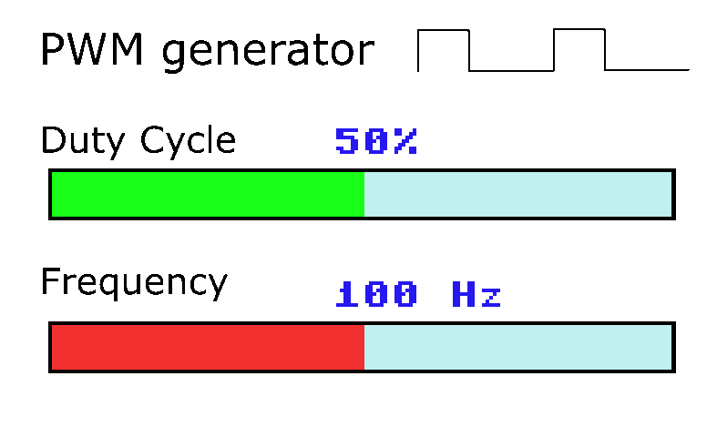
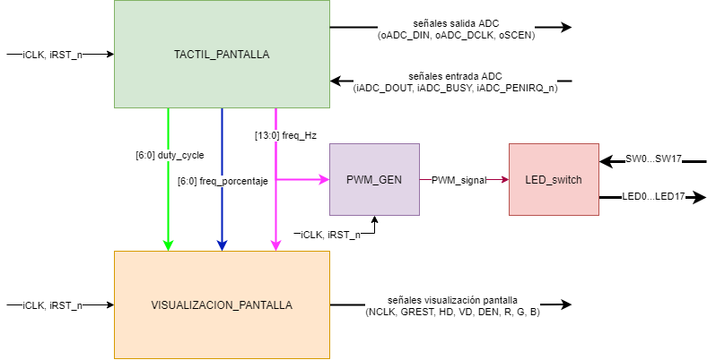

# pwm_gen_fpga
PWM generator for LEDs with Altera Cyclone IV FPGA and TerAsic LTM screen (DE2-115 Board)

## Features
- 2 sliders: Duty Cycle and Frequency.
- Duty Cycle: from 0% to 100%.
- Frequency: logarithmic slider, from 1 Hz to 10000 Hz.
- 800x480 resolution.
- PWM signal sent to each of the 18 red LEDs of the DE2-115 board, each controlled with a switch.

## Screen example

## Design structure

## Videos
[Touch screen](https://drive.google.com/file/d/1YxsNYwD1vSnOIBkRYP5XCaiazzp8HI21/view)

[Whole system](https://drive.google.com/file/d/15n_yMDt2zHOfJ2vnyxHMe-jcFEKqDAVf/view)
